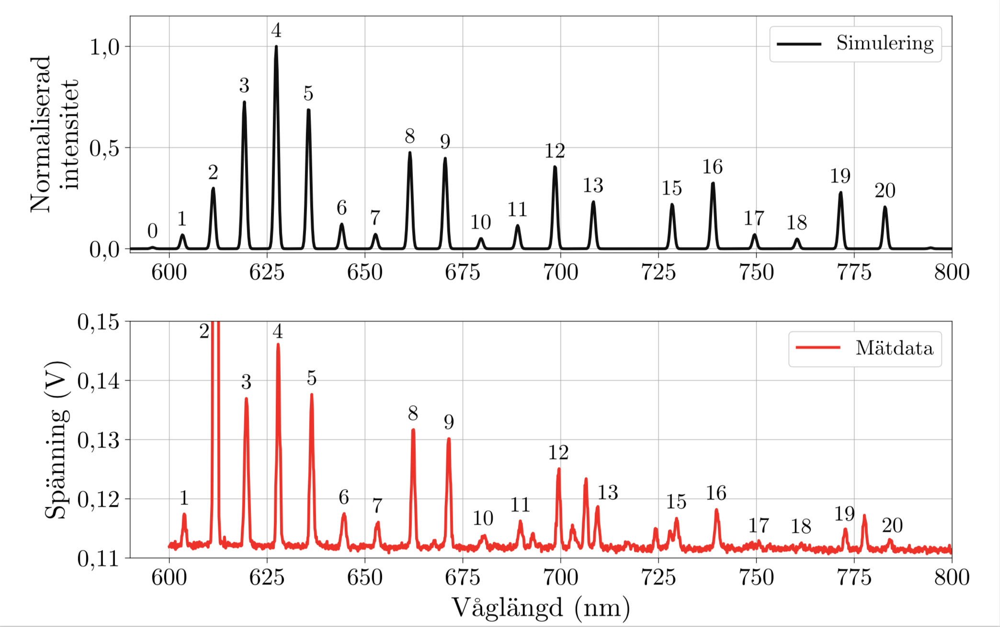
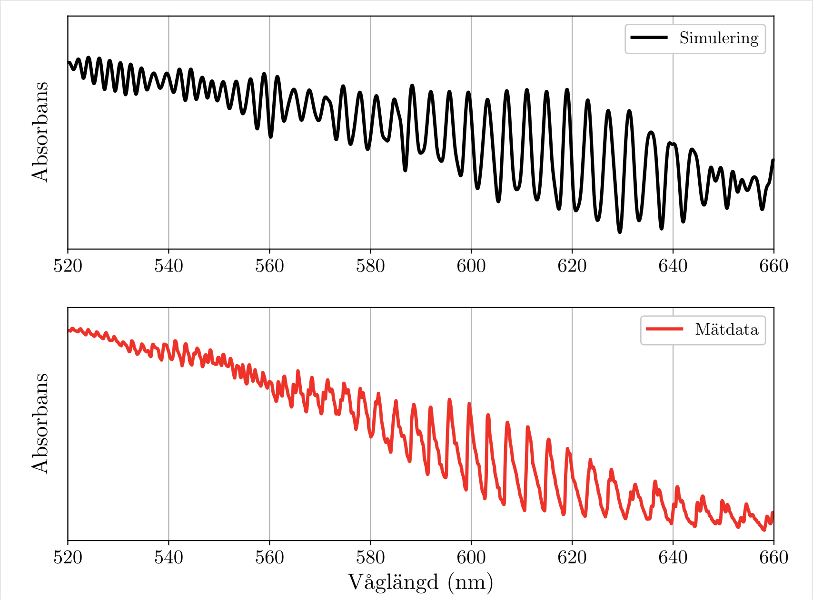

## Simulation of the vibrational spectrum of diatomic molecules

Fluorescence and absorption spectrum of molecular iodine are simulated using Frank-Condon factors and Morse potentials for the vibrational energy.
The results seem to match experimental data fairly well for low vibrational states (v < 20).
The program was created to explain the result of an undergraduate spectroscopy experiment.

The simulation computes the wavelengths and relative intensities of transitions. The shape of the spectral lines are arbitrarily chosen to be gaussian. Which transitions are active is chosen manually.

Python scripts in root folder are executable usage examples. The program can easily be adapted to other diatomic molecules by providing adittional data in module/vib_energy_levels.py

## Sample results

Simulated (top) and observed (bottom) fluorescence spectrum of molecular iodine (intensity vs wavelength)

Simulated (top) and observed (bottom) absorption spectrum of molecular iodine (absorbance vs wavelength)